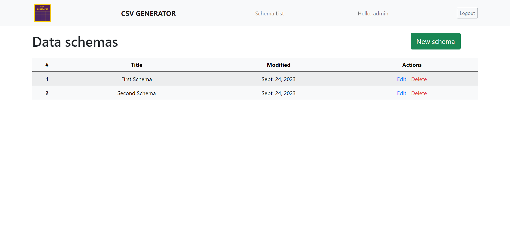
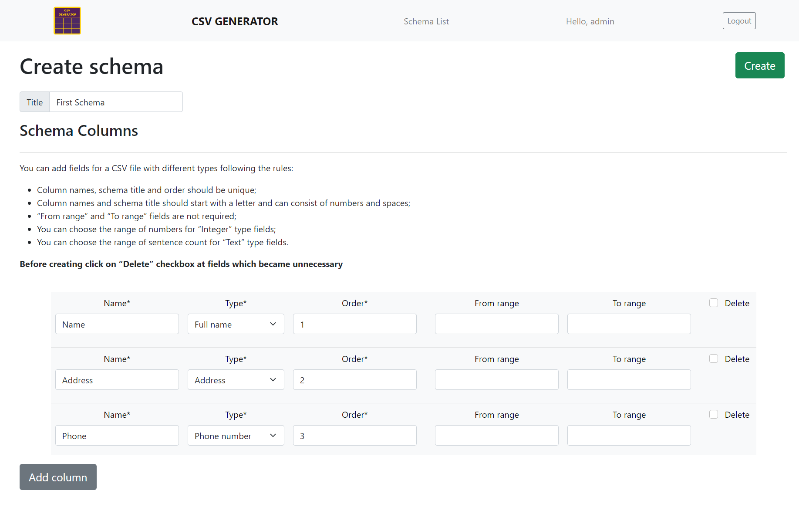
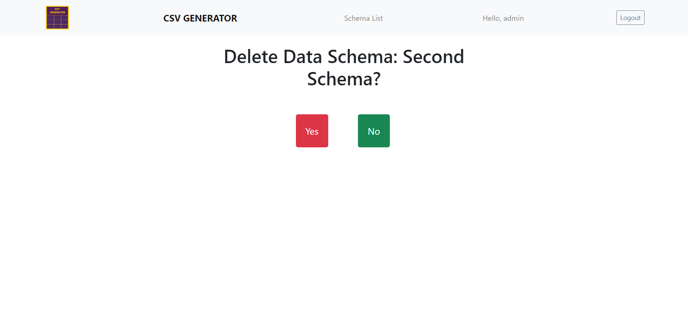

<div align="center">

# CSV File Generator
 

</div>

<br>

> Create any CSV File you like with dummy data!

<hr>

## Table of Contents

- [About Project](#about-project)
- [Application functional](#functional)
- [Technologies](#technologies)
- [Prerequisites](#prerequisites)
- [Setup](#setup)
- [Accessing the Application](#accessing-the-application)
- [Shutdown](#shutdown)
- [Demo](#demo)


<hr>

## About Project

In today's data-driven world, the ability to swiftly generate CSV files with varying 
numbers of rows and diverse columns containing dummy data is a valuable asset 
for businesses, developers, and data enthusiasts alike. 
<br>
A CSV File Generator is a versatile tool that simplifies the process of creating customized datasets
for database bootstrapping and crafting well-structured XML documents. 
<br>

This tool provides an efficient and convenient means of generating synthetic data for 
testing, development, or even educational purposes.
<br>
<hr>

## Functional

1. Register a new user account on the admin page <br> (superuser required)
2. Create data schema for a CSV file
3. Add any count of columns to the data schema you would like to
4. Choose the data type and order for each column
5. Pick the row count before generating a CSV file
6. Check in real time the generating CSV file status 
7. Download the CSV file 
8. Observe all generated files history of the data schema 
9. Have access to all data schemas you have created 
10. Edit data schema <br> (add new columns, rename columns, change their order, etc)
11. Delete data schema

<hr>

## Technologies

- [Django Official Documentation](https://docs.djangoproject.com/)
<br>`Django` is a high-level Python Web framework. 
In this project, it's used to create the backend service. 
<br>This service builds the Django application and exposes it on port 8000.


- [Postgres Official Documentation](https://www.postgresql.org/docs/)
<br>`Postgres` is a powerful, open-source object-relational database system. 
In this project, it is used as the main data store. 
<br>This service runs the latest version of Postgres, exposed on port 5432.


- [Celery Official Documentation](https://docs.celeryq.dev/en/stable/)
<br>`Celery` is a simple, flexible, and reliable distributed system to process vast amounts of messages, 
while providing operations with the tools required to maintain such a system.
It’s a task queue with focus on real-time processing, while also supporting task scheduling. 
<br>In this project, it is used to run generating CSV tasks in the background. 


- [Redis Official Documentation](https://redis.io/docs/)
<br>`Redis` is an open source (BSD licensed), in-memory data structure store used as 
a database, cache, message broker, and streaming engine. 
<br>In this project, it is used as a Celery message broker. 


- [WebSockets Official Documentation](https://websockets.readthedocs.io/en/stable/index.html)
<br>`websockets` is a library for building WebSocket servers and clients in Python with a focus on 
correctness, simplicity, robustness, and performance.
<br>In this project, it is used for real-time status control of generated CSV files. 


- [Nginx Official Documentation](https://nginx.org/en/)
<br>`nginx` is an HTTP and reverse proxy server, a mail proxy server, and a generic TCP/UDP proxy server.
<br>In this project, it is used for serving static files. 

<hr>


## Prerequisites

1. Make sure you have Python installed on your system. 
You can check the installation instructions [here for Python](https://www.python.org/downloads/).
2. Make sure you have Docker and Docker Compose installed on your system. 
You can check the installation instructions [here for Docker](https://docs.docker.com/get-docker/) 
and [here for Docker Compose](https://docs.docker.com/compose/install/).

<hr>

## Setup

1. Clone the project:
```
https://github.com/diana-shyrokikh/csv-files-generator.git
```
2. Navigate to the project directory:
```
cd csv-files-generator
```
3. Сreate your .env file taking as an example .env.example file


4. Build and run the Docker containers:
```
docker-compose build
docker-compose up
```

5. Create a superuser:
``` 
docker-compose exec web /bin/bash
python manage.py createsuperuser
```

<hr>

## Accessing the Application

1. CSV File Generator is accessible at `http://localhost/`.
2. Django Admin Page is accessible at `http://localhost/admin`.

<hr>

## Shutdown

1. To stop running server use CTRL-BREAK

<hr>

## Demo






<hr>
Remember to replace `localhost` with the relevant 
IP address (127.0.0.1) if you're not accessing these from 
the same machine where the services are running.

